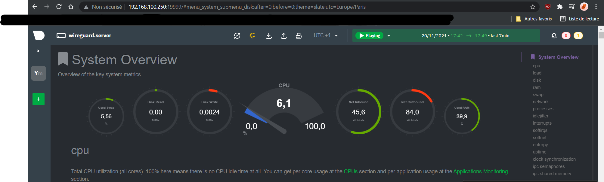

# Mise en place d'un monitoring pour le serveur

1. On met le système à jour
```bash
[yrlan@wireguard ~]$ sudo dnf update
```
2. On passe en root puis on lance le script d'install de netdata et on active le service au démarrage + maintenant
```bash
[yrlan@wireguard ~]$ su -
[root@wireguard ~]# bash <(curl -Ss https://my-netdata.io/kickstart.sh)
[root@wireguard ~]# sudo systemctl enable --now netdata
```
3. On configure le pare-feu pour autoriser le port qu'utilise netdata
```bash
[yrlan@wireguard ~]$ sudo ss -alnpt | grep netdata
LISTEN 0      128        127.0.0.1:8125       0.0.0.0:*    users:(("netdata",pid=145562,fd=42))
LISTEN 0      128          0.0.0.0:19999      0.0.0.0:*    users:(("netdata",pid=145562,fd=5))
LISTEN 0      128            [::1]:8125          [::]:*    users:(("netdata",pid=145562,fd=41))
LISTEN 0      128             [::]:19999         [::]:*    users:(("netdata",pid=145562,fd=6))

[yrlan@wireguard ~]$ sudo firewall-cmd --add-port=19999/tcp --permanent; sudo firewall-cmd --reload; sudo firewall-cmd --list-all
success
success
public (active)
  target: default
  icmp-block-inversion: no
  interfaces: enp0s3 enp0s8
  sources:
  services: ssh
  ports: 19999/tcp
  protocols:
  masquerade: no
  forward-ports:
  source-ports:
  icmp-blocks:
  rich rules:
```
Voilà a quoi cela ressemble une fois mis en place, on se rend à l'adresse : `<IP_machine>:19999`

